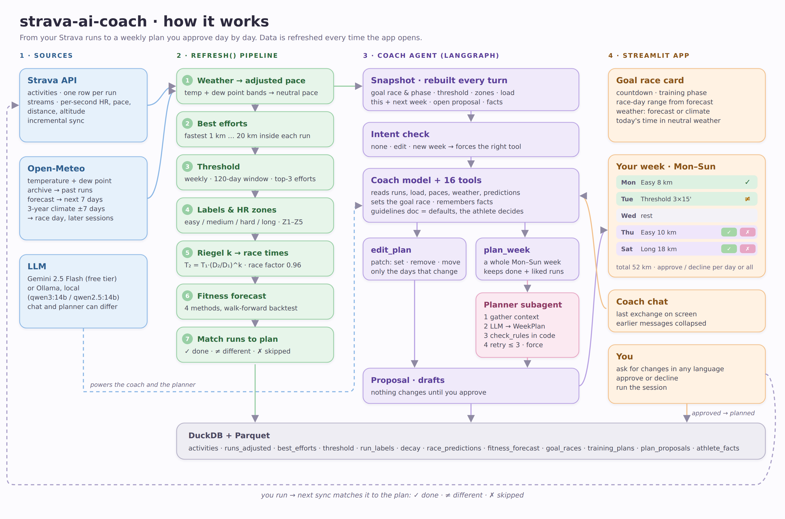

> 🔒 **Note:** The implementation details and Python source code for this project are maintained in a private repository. Access can be granted to hiring teams upon request during technical interviews.

# strava-ai-coach

A running coach built on your own training data.

It pulls your runs from Strava and corrects them for the weather. From them it
works out your threshold, predicts race times, and forecasts how fit you will
be on race day. A coach agent then builds each week's plan, which you approve
or decline day by day.



---

## Contents

1. [Quick start](#quick-start)
2. [How it fits together](#how-it-fits-together)
3. [Methodology](#methodology)
   - [Making runs comparable: weather](#1-making-runs-comparable-weather)
   - [Best efforts](#2-best-efforts)
   - [Threshold](#3-threshold)
   - [Session labels and HR zones](#4-session-labels-and-hr-zones)
   - [Race prediction: Riegel k](#5-race-prediction-riegel-k)
   - [Fitness forecast: race-day range](#6-fitness-forecast-race-day-range)
   - [Goal race and training phase](#7-goal-race-and-training-phase)
4. [The coach agent](#the-coach-agent)
5. [Defaults at a glance](#defaults-at-a-glance)
6. [Assumptions and known limits](#assumptions-and-known-limits)
7. [Reference](#reference): layout, tables, several athletes, fresh start

---

## Quick start

Always run commands from the project root.

```bash
python3 -m venv venv
source venv/bin/activate
pip install -r requirements.txt
```

Create a `.env` file in the root. Never commit it.

```
STRAVA_CLIENT_ID=...
STRAVA_CLIENT_SECRET=...
STRAVA_REFRESH_TOKEN=...          # needs scope activity:read_all

LLM_PROVIDER=gemini               # or: ollama
GOOGLE_API_KEY=...                # for gemini (free tier)
GEMINI_MODEL=gemini-2.5-flash
# OLLAMA_MODEL=qwen3:14b          # for ollama; default qwen2.5:14b
# OLLAMA_CONTEXT=16384
# PLANNER_PROVIDER=gemini         # optional: a different model for the planner
```

To get a refresh token with the right scope, run
`python get_new_refresh_token.py`. A token with only `read` authenticates
fine, then fails with a 401 error on activities.

To run the app:

```bash
streamlit run src/ui/app.py
```

Opening the app runs `refresh()`, which does the rest. It is incremental, so it
only fetches what is new. To refresh without the UI, run
`python src/pipeline.py`.

---

## How it fits together

There are four blocks, one per column of the diagram.

| Block | What it does | Where |
|---|---|---|
| **Sources** | Strava (runs and per-second streams), Open-Meteo (weather), an LLM (Gemini or Ollama) | `src/ingestion/`, `src/agent/llm.py` |
| **Pipeline** | `refresh()`: sync, weather, threshold, labels, race times, forecast, plan matching | `src/pipeline.py`, `src/features/`, `src/models/` |
| **Coach agent** | A LangGraph agent with tools, plus a planner subagent | `src/agent/` |
| **App** | Streamlit: goal race card, week table with approve/decline, charts, chat | `src/ui/app.py` |

Everything is stored in one DuckDB file. Per-run streams are Parquet files.

`refresh()` runs these steps in order:

```
sync → runs_weather → runs_adjusted → best_efforts → threshold → run_labels
     → pace_features → decay (k) → race_predictions
     → agent tables → match runs to plans → fitness_forecast
```

---

## Methodology

### 1. Making runs comparable: weather

The same effort is slower in heat. Every run therefore gets a second pace:
what it would have been in neutral weather.

**Weather source.** Open-Meteo, free and with no API key. Coordinates are
rounded to 0.1° (about 11 km), so one request covers one area.
`start_date_local` is already local time even though it ends in `Z`: the `Z`
is stripped, not converted.

**Why dew point.** Dew point says whether sweat can evaporate. Relative
humidity cannot say that on its own: 90% at 5 °C is harmless, and 90% at 28 °C
is brutal.

**Adjustment.** The adjustment is set by **temperature + dew point** in °C.
Within each band, the midpoint is used.

| T + Td (°C) | ≤20 | 20–25.6 | 25.6–31.1 | 31.1–36.7 | 36.7–42.2 | 42.2–47.8 | 47.8–53.3 | 53.3–58.9 | 58.9–64.4 | >64.4 |
|---|---|---|---|---|---|---|---|---|---|---|
| slower by | 0 | 0–0.5% | 0.5–1% | 1–2% | 2–3% | 3–4.5% | 4.5–6% | 6–8% | 8–10% | don't train hard |

```
adjusted_pace = actual_pace / (1 + adjustment)
```

Example: 24.8 °C with a dew point of 22.1 °C gives a sum of 46.9, which is
3.75% slower. So 5:44/km in those conditions is about 5:31/km neutral.

**The one rule about heat: correct it once.** Heat is applied only when
*judging* a run (its adjusted pace) and when *predicting* a race in given
weather. Prescribed paces are never slowed for the forecast. A plan says
"threshold 4:48"; on a hot day you run by feel, and afterwards the run's
adjusted pace is compared with 4:48. Adjusting both sides would count the
heat twice.

**Future weather** is used for race day and for upcoming sessions:
- **7 days or less away:** the Open-Meteo forecast at your usual hour and
  place.
- **Further away:** climatology. The last **3 years** of archive data, ±7 days
  around the date, at the same hour. This gives a typical value plus a cool
  case (10th percentile) and a warm case (90th percentile).

### 2. Best efforts

There are no races in the data, so performances are taken from training. For
every run, a two-pointer scan of the stream finds the fastest continuous
stretch at 1, 2, 5, 10, 15 and 20 km, the half marathon, and beyond. Each time
is scaled to the exact distance (a "5 km" window is often 5003 m). Pauses
count, so repeats with the watch stopped never pass for a continuous 5 km.
Times are weather-corrected before any fit.

### 3. Threshold

Threshold pace is the fastest pace you can hold for about 30 minutes. It is
the reference for everything else: session labels, pace bands, zones and race
times. It is found without a test:

1. For each run, take the **10 minutes before the peak** of 30-second-smoothed
   HR, and record the mean pace and mean HR.
2. **Max HR** is the highest peak seen *up to that date*, never with
   hindsight.
3. Keep windows with mean HR **≥ 88% of max HR**. There is no upper limit.
4. Correct them for weather, rank them by neutral pace, and **average the top
   3**. The result is the threshold pace and the threshold HR (LTHR).
5. Report nothing if there are fewer than **6** qualifying efforts.

The threshold is recomputed **every 7 days over a 120-day window**, so every
run is judged against the threshold of its own day.

Check on the reference athlete: this method gives 4:48/km at 182 bpm; her
Garmin estimates 4:46 at 183.

### 4. Session labels and HR zones

**Labels** describe what a run *turned out* to be, not what was planned. The
first matching rule wins:

| Label | Rule |
|---|---|
| long | distance above the 85th percentile of your runs in the previous 90 days |
| hard | avg HR > 95% of LTHR **and** pace no slower than 1.25 × threshold pace |
| medium | avg HR > 88% of LTHR |
| easy | everything else |

HR leads and pace only vetoes: a high HR on a slow jog (heat, fatigue) is not
called hard. Runs from before the first threshold estimate stay unlabelled.

**HR zones** (Friel, as % of LTHR, in `src/features/zones.py`):

| Zone | % LTHR | Meaning |
|---|---|---|
| Z1 | < 85 | recovery |
| Z2 | 85–89 | aerobic |
| Z3 | 90–94 | tempo |
| Z4 | 95–99 | threshold |
| Z5 | ≥ 100 | above threshold |

Time in zones comes from the per-second stream. A gap between samples of more
than 10 s counts as a pause, not running time. The coach always gives zones in
bpm, because watches often use % of max HR, and "zone 2" can then mean two
different things.

### 5. Race prediction: Riegel k

```
T₂ = T₁ × (D₂ / D₁)^k          log T = log a + k · log D
```

`k` is how much your pace fades with distance. It is fitted per athlete as the
slope of a line through **all** best efforts on a log-log scale, not from two
distances. It is refit weekly on the previous 120 days.

- **Guards:** at least 4 distinct distances, and the longest at least 2× the
  shortest. If either fails, the population value k = 1.06 is used and the
  table flags `is_default`.
- **Race time** = training equivalent × **race factor 0.96** × weather
  adjustment for race day. The 0.96 reflects that training efforts have no
  taper and no competition. It is a guess until one real race calibrates it.
- **Reference athlete:** k = 1.061 with R² > 0.999.

This is **today's fitness**. The UI card shows it in neutral weather ("half
marathon today · neutral weather").

### 6. Fitness forecast: race-day range

The forecast answers one question: *how will threshold pace move between now
and the race?* Race time is assumed to move by the same percentage.

```
race-day time = today's prediction (race-day weather) × (1 + forecast change)
```

**Horizon.** H = days to the goal race, clipped to 7–112 days. With no goal
race, H = 28.

**Training examples.** For every weekly threshold value in the past, the
system records the features known on that date and the target: the % change
of threshold pace **H days later**. That later value must exist within
±10 days; otherwise the example is dropped.

| Feature | Meaning |
|---|---|
| `km_week` | average weekly km, last 4 weeks |
| `quality_share` | share of those km in hard or medium runs |
| `longest_km` | longest run, last 4 weeks |
| `trend` | the recent trend projected over H (see below) |
| `gap_to_best` | how far today's threshold is from its best so far |

**The trend.** It is a weighted straight line through the threshold estimates
of the **last 16 weeks**. Weights halve every **28 days**, so this week counts
twice as much as a week 4 weeks ago. After a **break** (more than 21 days with
no estimate), only the weeks since the break are used. The trend becomes a
projection with `change per week × weeks left ÷ today's pace`.

**Four methods compete:**

| Method | Prediction |
|---|---|
| `no_change` | the threshold stays where it is (the baseline) |
| `trend` | the weighted trend continues all the way to the race |
| `trend_half` | half of that: improvement slows near a ceiling |
| `ridge` | Ridge regression (standardised, α = 1) on the five features. Features are clipped to the training range so it never extrapolates volume. Needs at least 15 past examples. |

**Choosing the method.** The backtest walks forward: each past date is
predicted using only what came before it. The method with the lowest **MAE on
the last 12 predictions** wins. Recent predictions are used because you change
over time (a comeback, a plateau). A method that needs a feature missing today
can't be chosen.

**The range.** The winning method's past errors give the range: its 10th and
90th percentiles, added to the prediction. This is an 80% range: the true value
fell inside it 80% of the time.

**Safety cap.** A forecast is never more optimistic than the full trend
carrying on unchanged. When the cap is applied, the method is labelled
"(capped at trend)".

**Too little history** (fewer than 10 backtest points): the method is
`no_change`, so the race-day time equals today's prediction, with the spread of
past changes as the range.

The forecast is rebuilt on every refresh and saved to `fitness_forecast`. To
inspect it:

```bash
python src/models/fitness/forecast.py        # full backtest at the goal-race horizon
python src/models/fitness/forecast.py 60     # try 60 days; saves nothing
```

### 7. Goal race and training phase

You set the goal race from the chat ("I've entered the Rome half on
15 November"), and the app's race card updates. The distance is one of `5k`, `10k`, `half` or
`marathon`. The **phase** comes from the number of weeks to the race:

| Race distance | build starts | specific starts | taper starts |
|---|---|---|---|
| up to 10 km | 12 weeks out | 5 | 1 |
| up to half | 12 | 6 | 2 |
| marathon | 16 | 8 | 3 |

Before the build starts, the phase is base. With no goal race, the coach
trains a rolling base.

| Phase | Focus |
|---|---|
| base | easy volume, strides, a growing long run |
| build | 1–2 quality sessions a week |
| specific | work at and around goal pace |
| taper | volume −40–60%, same intensity and number of runs |

The race card shows the countdown, the phase, the race-day range from §6, and
the weather: the forecast if the race is 7 days or less away, otherwise
climate.

---

## The coach agent

The coach is a LangGraph `StateGraph` with three nodes: **model**, **tools**
and **summarise**. The chat is saved in SQLite (`chat.sqlite`), so it survives
restarts. After 40 messages, older ones are folded into a summary and the last
16 are kept.

### What the model sees every turn

A **snapshot**, rebuilt from the database on each message. It contains:
- today's date, the goal race and phase;
- threshold pace and HR, and your zones in bpm;
- training load and the last run;
- **the real Mon–Sun week** (this week and next), with statuses and plan ids;
- any open proposal, and the facts you asked it to remember.

The snapshot is the source of truth. The model is told to trust it over
anything said earlier in the chat. This is what stops it hallucinating a plan.

### Tools (16)

| Area | Tools |
|---|---|
| Reading | `get_last_run` (incl. time in zones), `get_recent_runs`, `get_training_load`, `get_paces_for_session`, `get_conditions`, `predict_race_time` (today + race-day range), `get_guidelines`, `get_plans` |
| Goal race | `set_goal_race`, `clear_goal_race` |
| Planning | `plan_week`, `edit_plan` |
| Bookkeeping | `confirm_planned_run`, `skip_plan`, `remember`, `forget` |

### Act, don't describe: intent check and forced tool choice

LLMs like to *describe* a plan change instead of making it. So before the
model answers, a small classifier (a regex filter, then the LLM) labels the
message as `none`, `edit` or `new_week`. For `edit` and `new_week`, the first
model step is **forced** (`tool_choice="any"`) to call `edit_plan` or
`plan_week`. That way a change is always a tool call, never just text.

### Two ways to change a plan

- **`edit_plan`**: a JSON-patch-style list of operations (`set`, `remove`,
  `move`), touching only the days that change. This is the default. A rest
  day is a `remove`, never a 0-minute session. Every operation is validated
  before any is applied. If a proposal is already open, the edits merge into
  it.
- **`plan_week`**: a whole Mon–Sun week, for a new week or an explicit
  "redo it". It keeps runs already done this week, and any sessions you liked
  (`keep_plan_ids`).

### The planner subagent

`plan_week` calls a **separate LLM call with its own prompt** (the "agent as a
tool" pattern). Code does what code does best, and the model only plans:

1. **Gather** (code): phase, threshold, pace bands, zones, load for the last
   4 weeks, longest run for the last 30 days, fixed days (done or kept), your
   preferences and notes, and the weather per day.
2. **Plan** (LLM): returns a structured `WeekPlan`. Each session is a list of
   phases from a fixed English vocabulary (warm-up, easy, long, steady, race
   pace, threshold, intervals, hills, cool-down). Each phase has minutes, pace,
   repeats, recovery and target HR. This gives the same format every time.
3. **Check** (code), `check_rules` over the whole week, fixed days included:
   - no hard day right after another hard day (the long run counts as hard);
   - at most 2 quality sessions (hard or medium);
   - at most 1 long run;
   - no run longer than 1.10 × the longest of the last 30 days;
   - weekly km no more than 1.20 × the biggest of the last 4 weeks;
   - no phase of 0 minutes.
4. **Retry** up to 3 times, sending the errors back. If you asked for it
   anyway (**force**), rule errors (spacing, volume) are accepted and those
   sessions are marked **forced**, shown in grey. Structural errors (0-minute
   phases, a malformed week) are never accepted.

The result is saved as a **proposal**, never as the plan itself.

### Proposals: nothing changes until you approve

- Proposed sessions are **drafts** linked to a `plan_proposals` row. The week
  table shows them next to the current plan, with **approve ✓ / decline ✗ per
  day**, plus **Approve all / Decline all**.
- Approving a day turns its draft into `planned` and retires what it replaces.
  Declining drops the draft.
- A proposal closes automatically when no day is left open. Starting a new
  proposal declines the previous one.
- Moving a hard session next to another hard one marks it forced.

### After you run

On the next refresh, each new run is matched to that day's plan:

| Mark | Meaning |
|---|---|
| ✓ | done |
| ≠ | done, but different from the plan |
| ✗ | past planned session with no run: skipped |

An unplanned run is *not* turned into a plan. When reviewing a run, the coach
compares its **weather-adjusted** pace with the **prescribed** pace.

### Behaviour principles (in `src/agent/prompt.py`)

- **The athlete decides.** The guidelines are defaults, not gates. When you
  ask for something against them, the coach gives its view with numbers in one
  or two sentences, then proposes it anyway. It never refuses and never says
  "ask another coach".
- It replies in your language. Plan content is always in English.
- Its numbers come from tools, never from memory. It says when a prediction is
  an extrapolation.
- It uses its general running knowledge freely. The guidelines document
  (`src/agent/knowledge/training_guidelines.md`, with rules tagged
  [strong], [moderate] or [convention]) settles the points where consistency
  matters.
- It doesn't diagnose. Pain means a physio or a doctor.

### Pace bands (× threshold pace, neutral weather)

| Session | Band | Quality sessions use |
|---|---|---|
| easy | 1.20–1.30 | |
| long | 1.15–1.25 | |
| medium | 1.08–1.15 | |
| threshold | 1.00–1.02 | the fast end: threshold pace itself |
| intervals | 0.93–0.98 | the fast end |

### LLM choice

Set in `src/agent/llm.py` from `.env`:

| Setting | Options | Default |
|---|---|---|
| `LLM_PROVIDER` | `gemini`, `ollama` | `gemini` |
| `GEMINI_MODEL` | | `gemini-2.5-flash` (free tier, rate-limited) |
| `OLLAMA_MODEL` | `qwen3:14b` suggested for 18 GB | `qwen2.5:14b` |
| `OLLAMA_CONTEXT` | | `16384` |
| `PLANNER_PROVIDER` | a different provider for the planner only | same as `LLM_PROVIDER` |

A useful mix is a local chat model with Gemini for the planner, since planning
is the hardest structured task. With Ollama, structured output uses
`json_schema`.

---

## Defaults at a glance

| What | Value | Where |
|---|---|---|
| Weather correction | T + Td bands, band midpoint | `features/adjusted_pace.py` |
| Future weather | forecast ≤ 7 days, otherwise 3-year climate ±7 days (p10/p90) | `ingestion/forecast.py` |
| Threshold | every 7 days, 120-day window, HR ≥ 88% max, top 3, needs ≥ 6 efforts | `features/threshold.py` |
| Effort window | 10 min before the peak of 30 s-smoothed HR | `features/threshold.py` |
| Labels | long > p85 of 90 days; hard > 95% LTHR and pace ≤ 1.25×; medium > 88% LTHR | `features/classify.py` |
| HR zones | 85 / 90 / 95 / 100% of LTHR | `features/zones.py` |
| Riegel k | weekly, 120 days, ≥ 4 distances, max/min ≥ 2, otherwise 1.06 | `models/predictions/race.py` |
| Race factor | 0.96 | `models/predictions/race.py` |
| Forecast horizon | days to race, clipped 7–112; 28 with no race | `models/fitness/forecast.py` |
| Trend | 16 weeks, half-life 28 days, break > 21 days | `models/fitness/forecast.py` |
| Method choice | MAE on the last 12 backtest points; ridge needs ≥ 15 examples | `models/fitness/forecast.py` |
| Range | p10–p90 of the method's past errors (80%) | `models/fitness/forecast.py` |
| Phases | see §7 | `agent/context.py` |
| Planner rules | ≤ 2 quality, ≤ 1 long, no hard back-to-back, run ≤ 1.10× longest in 30 days, week ≤ 1.20× max of last 4 | `agent/planner.py` |
| Planner retries | 3 | `agent/planner.py` |
| Chat memory | summary after 40 messages, keep 16 | `agent/graph.py` |

---

## Assumptions and known limits

**Weather**
- The heat bands are coaching heuristics. They are consistent with Ely et al.
  (2007) for non-elite runners, but they are not fitted to you.
- Sun, wind, rain and heat acclimatisation are ignored.
- The correction is the same at every intensity.
- HR is not weather-corrected, so summer runs lean towards harder labels.

**Threshold**
- It needs some near-threshold running in the last 120 days. Without it,
  nothing is reported.
- Max HR is the highest *observed* value. The 88% floor partly compensates.
  The floor does not change with training level or sex.

**Best efforts and k**
- They come from training, so they are submaximal. That is why the race
  factor exists, and that factor is the least certain number in the chain.
- Riegel is optimistic for the marathon.
- Interval segments can enter the fit, and course elevation is not modelled.

**Forecast**
- It assumes race time moves by the same % as threshold pace.
- A few seasons of history make a small backtest, so the range is wide on
  purpose.
- A comeback after a break improves fast, which the capped trend and the
  break handling are there to contain.

**Labels**
- One label per run.
- Intervals are not told apart from continuous hard runs.

**The coach**
- An LLM can still misread a request. The snapshot, forced tool choice, patch
  edits, code-side rule checks and approve-first proposals keep mistakes
  visible and reversible.
- It is not a medical tool.

---

## Reference

### Layout

```
src/
  paths.py                  all paths; ATHLETE switch; loads .env
  pipeline.py               refresh()
  ingestion/  strava_client.py · sync.py · weather.py · forecast.py (future weather)
  features/   adjusted_pace.py · best_efforts.py · threshold.py · classify.py · zones.py
  models/
    pace_model/             per-run features
    predictions/race.py     k and race times
    fitness/forecast.py     race-day fitness forecast
  agent/
    graph.py                LangGraph: intent check, forced tools, memory
    prompt.py               the coach's instructions
    context.py              snapshot, phase, week text
    tools.py                the 16 tools
    planner.py              planner subagent + check_rules
    store.py                facts, plans, proposals, goal race
    llm.py                  Gemini / Ollama
    knowledge/training_guidelines.md
  ui/app.py                 Streamlit
docs/architecture.png
```

### Tables (DuckDB)

| Table | Contents |
|---|---|
| `activities` | one row per run |
| `runs_weather`, `runs_adjusted` | conditions; pace corrected to neutral |
| `best_efforts`, `effort_windows` | fastest stretch per distance; 10-min windows before the HR peak |
| `threshold` | threshold pace and HR, one row per week |
| `run_labels`, `pace_features` | session labels; per-run features |
| `decay`, `race_predictions` | k per week; predicted times |
| `fitness_forecast` | the forecast change, its range, method, horizon |
| `goal_races` | the goal race |
| `training_plans` | sessions: planned / done / skipped / moved / draft, `forced`, `proposal_id` |
| `plan_proposals` | proposals and their status |
| `athlete_facts` | things the coach remembers (injuries, preferences) |

### Several athletes

Set `ATHLETE` to give each person their own data folder and `.env`:

```bash
# .env.marco holds Marco's STRAVA_* keys (his refresh token)
ATHLETE=marco python get_new_refresh_token.py
ATHLETE=marco streamlit run src/ui/app.py --server.port 8502
```

His data goes to `data/marco/`. Leave `ATHLETE` unset to keep the original
`data/` layout. A Strava app allows one athlete until you raise its capacity in
the Strava API settings.

### Fresh start for the chat

Stop the app and delete `data/chat.sqlite` (or `data/<athlete>/chat.sqlite`).
Plans, the goal race and remembered facts are in DuckDB and stay.

### References

- Ely, Cheuvront, Roberts, Montain (2007). Impact of weather on
  marathon-running performance. *Med Sci Sports Exerc* 39(3).
- Riegel (1977). Time predicting. *Runner's World*.
- Blythe, Király (2016). Prediction and quantification of individual athletic
  performance of runners. *PLOS ONE* 11(6).
- Jones et al. (2024). Fixed intensity anchors to estimate lactate thresholds
  in recreational runners. *Eur J Appl Physiol*.
- Friel. *The Triathlete's Training Bible*: HR zones from LTHR.
